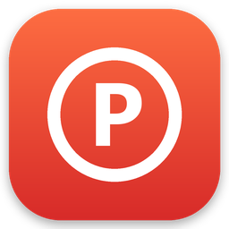
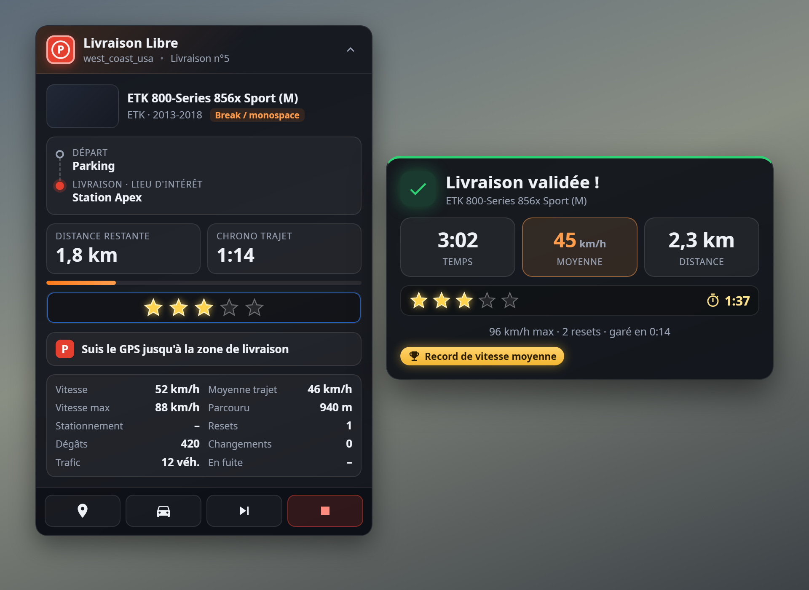
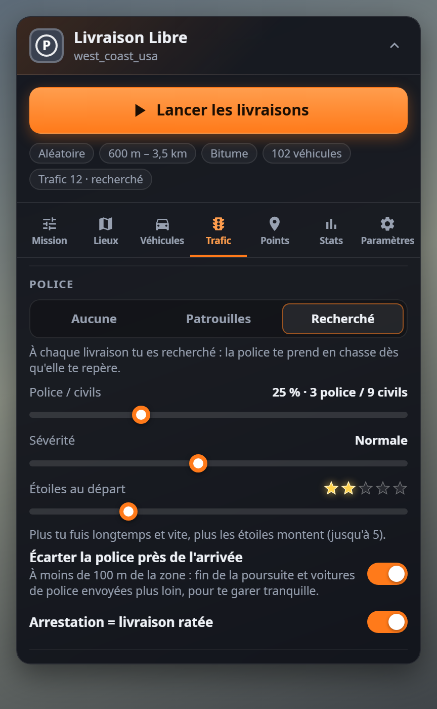
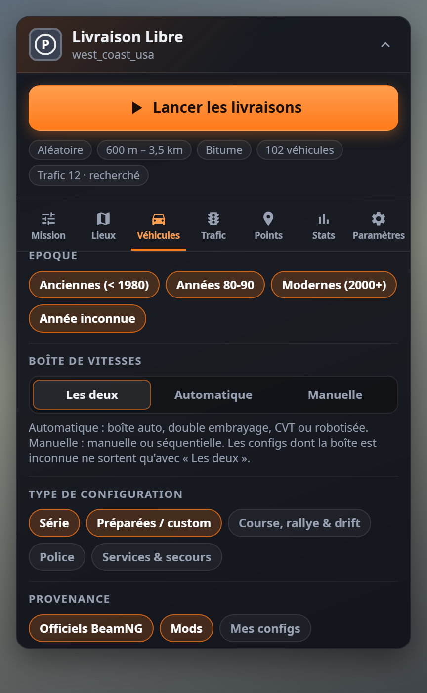
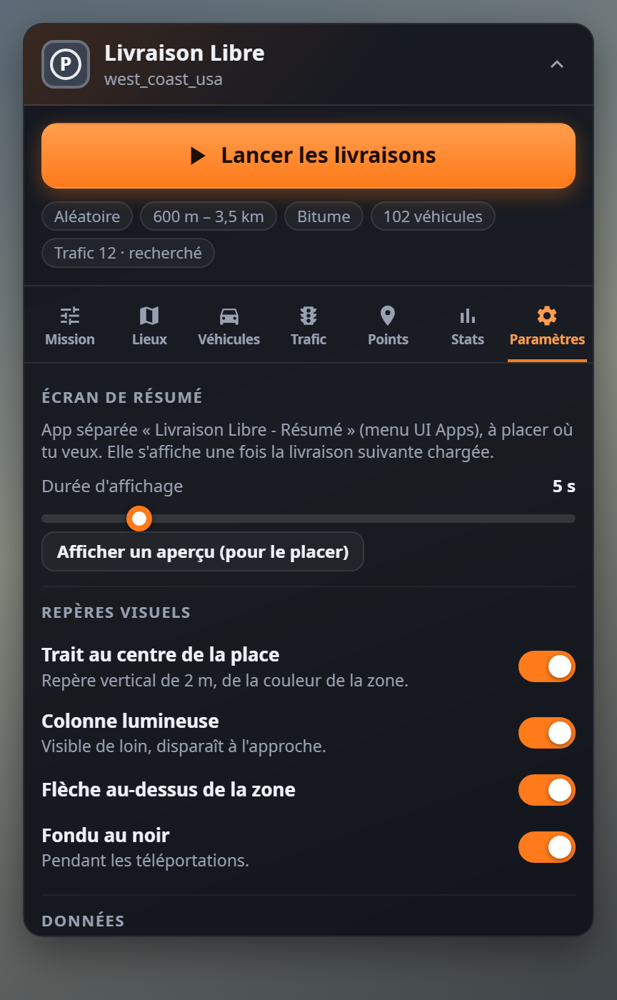
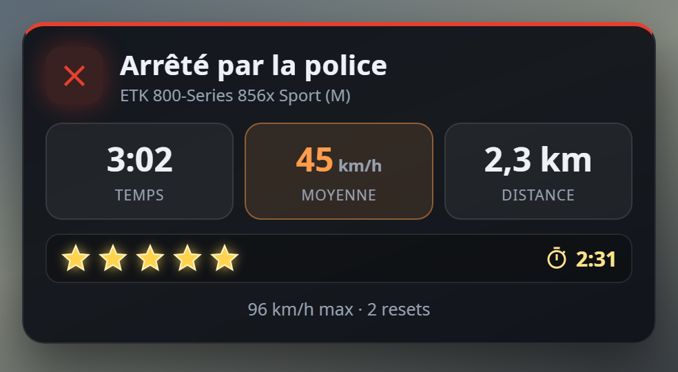

<div align="center">



# Livraison Libre

Des livraisons de véhicules en freeroam pour **BeamNG.drive**, façon « garage to garage » — sauf que c'est toi qui choisis les lieux, les distances, les voitures et le trafic.

[**⬇ Télécharger le mod**](https://github.com/StundZow/better-garage-to-garage/releases/latest/download/LivraisonLibre.zip) · [Releases](https://github.com/StundZow/better-garage-to-garage/releases)



</div>

## Ce que ça fait

Livraison Libre te téléporte à un point de départ avec un véhicule tiré au hasard, et te donne une place de parking à rejoindre ailleurs sur la map. Le GPS te guide jusqu'à une zone **P** rouge au sol : gare-toi entièrement dedans — elle passe au **bleu** — serre le frein à main, c'est livré. Écran noir, nouvelle voiture, nouvelle destination, et ça repart.

Chaque trajet est chronométré, un petit écran de résumé (à placer où tu veux) te montre ta perf une fois la livraison suivante chargée, et tout est noté dans un journal CSV.

## Pourquoi pas juste le « garage to garage » du jeu ?

Parce qu'il tourne toujours entre les mêmes garages. Ici les destinations viennent de **toute la map** — bords de route, parkings, lieux d'intérêt, allées de maisons — ou de tes propres points, à la distance que tu veux, et chaque livraison se fait avec un véhicule différent, mods compris, filtré selon tes goûts.

## Fonctionnalités

- 🗺️ **Destinations aléatoires** sur le réseau routier de la map : bords de route, parkings, lieux d'intérêt, maisons et allées privées — ou **tes propres points** enregistrés
- 📏 **Distance min / max par la route** (pas à vol d'oiseau), routes bitumées seulement ou terre incluse, voies rapides évitables
- 🚗 **Véhicule aléatoire** parmi tous ceux installés, mods compris : filtres par catégorie, époque, variante et source, liste noire, jamais de props ni de remorques
- 🅿️ **Zone P au sol** à 1,3× la taille du véhicule, rouge → bleue quand tu es entièrement dedans, avec un trait de 2 m au centre de la place
- ✋ **Validation au frein à main**, ou **validation éclair** : 0,25 s après le frein à main, la livraison suivante est déjà lancée
- 🧭 **Départ dans le sens du GPS**, peinture aléatoire, temps limite optionnel
- ⏱️ **Perfs honnêtes** : chrono lancé à la 1re accélération et arrêté à 50 m de la zone — le stationnement est mesuré à part
- 🚓 **Trafic et police** : sans trafic, avec trafic, patrouilles (ratio police / civils réglable) ou recherché, avec **jusqu'à 5 étoiles** qui montent tant que tu fuis
- 🔕 **Les PNJ ignorent les sirènes** pendant les livraisons — ils continuent de rouler au lieu de se ranger — et la police est écartée à moins de 100 m de l'arrivée pour te garer tranquille
- 📊 **Écran de résumé** séparé, affiché de 3 à 15 s : temps, moyenne, distance, étoiles atteintes et temps survécu en poursuite, et une 🏆 coupe quand tu bats un record
- 📝 **Journal de chaque livraison** en CSV (s'ouvre dans Excel) : véhicule(s), distance, vitesses, resets, dégâts, changements de véhicule, trafic, police…
- 💾 **Tous les réglages sauvegardés** ; pendant une mission, le panneau n'affiche que la mission en cours

<div align="center">

&nbsp;

&nbsp;

</div>

## Prise en main

1. [Télécharge `LivraisonLibre.zip`](https://github.com/StundZow/better-garage-to-garage/releases/latest/download/LivraisonLibre.zip) et dépose-le **tel quel** (sans le dézipper) dans ton dossier de mods : `%LOCALAPPDATA%\BeamNG\BeamNG.drive\current\mods\`. Fais-le jeu fermé : BeamNG recharge les mods à chaud et n'aime pas qu'on les remplace en pleine partie.
2. Lance une map en **freeroam**.
3. Échap → **UI Apps** → ajoute **Livraison Libre** (le panneau) et **Livraison Libre - Résumé** (l'écran de perfs), et place-les où tu veux. Onglet **Paramètres** → *Afficher un aperçu* t'aide à caser le résumé.
4. Règle tes lieux, véhicules et trafic dans les onglets, puis clique **Lancer les livraisons**.

*(Raccourcis optionnels dans Options › Contrôles › Gameplay : lancer / arrêter, passer la livraison, nouvelle destination, afficher / réduire le panneau.)*

## Comment ça marche

Au lancement, le mod construit son propre graphe à partir du réseau routier de la map, repère les impasses privées (les allées de maisons) et y ajoute les places de parking et lieux d'intérêt fournis par la map. Un Dijkstra borné choisit ensuite une destination dont la distance **par la route** tombe dans ta fourchette, sur une place libre et assez grande pour le véhicule tiré.

La zone au sol est le marquage « P » du jeu, redimensionné à la taille du véhicule ; elle passe au bleu dès que la boîte englobante du véhicule est entièrement dedans. Si tu changes de véhicule en route, la zone s'adapte — et si le nouveau ne rentre pas, la livraison passe à la place compatible la plus proche. Un véhicule avec lequel tu as roulé moins de 500 m n'est pas noté dans le journal.

Le résumé attend la fin de l'écran de chargement suivant pour s'afficher — sinon tu ne le verrais jamais. Les données sont dans `%LOCALAPPDATA%\BeamNG\BeamNG.drive\current\settings\livraisonLibre\` :

- `settings.json` — tous tes réglages
- `stats.json` — compteurs et records
- `livraisons.csv` / `livraisons.json` — une ligne par livraison (ferme Excel pendant que tu joues, sinon le CSV ne peut pas être mis à jour)
- `points/<map>.json` — tes points de livraison

## Police, étoiles et sirènes

En mode **Recherché**, chaque livraison démarre avec le nombre d'étoiles choisi (1 à 5). Ensuite c'est le jeu qui fait monter la note : plus tu fuis longtemps et vite, et plus tu enchaînes les infractions, plus le score de poursuite grimpe. Le mod le traduit en **0 à 5 étoiles** (paliers 100 / 300 / 500 / 1200 / 2000), affichées dans le panneau et dans le résumé avec le temps passé en fuite.

<div align="center">

</div>

Dans le jeu de base, les voitures de trafic se rangent dès qu'elles détectent un gyrophare à proximité — avec une police qui patrouille en permanence, toute la ville finit à l'arrêt. Pendant une livraison, le mod masque les gyrophares aux PNJ : ils continuent de rouler normalement. Si certains s'arrêtent encore, l'option *Police sans gyrophares ni sirènes* coupe directement les gyrophares des voitures de police. Tout est rétabli quand tu arrêtes les livraisons.

## Tester sans lancer le jeu

Les modules Lua tournent hors du jeu avec LuaJIT (via [lupa](https://pypi.org/project/lupa/)) dans un BeamNG simulé : une ville générée, des parties complètes jouées image par image (départ, trajet, zone, frein à main, changements de véhicule, police, sirènes…).

```bash
pip install lupa
python tests/run.py
```

`tests/test_vehicles.py` vérifie le classement des véhicules sur tes vrais fichiers (en lecture seule) si `BEAMNG_DIR` pointe vers le dossier du jeu. L'interface se teste dans un navigateur avec `python tests/ui/server.py`.

## Construire le mod depuis les sources

```bash
python build.py
```

Crée `dist/LivraisonLibre.zip` à partir du dossier `LivraisonLibre/`.

## Publier une nouvelle version (pour les mainteneurs)

```bash
python release.py 1.3 "Description des changements"
```

Ce script met à jour le numéro de version (Lua + apps UI), lance les tests, reconstruit le zip, tague la version et publie la release sur GitHub. Nécessite [GitHub CLI](https://cli.github.com/) authentifié.
