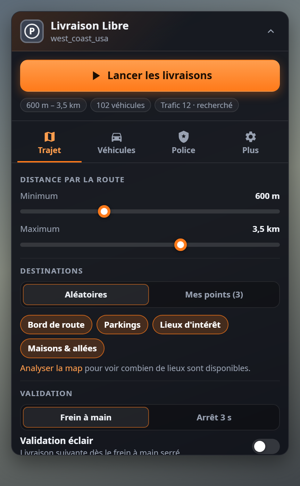

<div align="center">


# Better Garage to Garage

Des livraisons de véhicules en freeroam pour **BeamNG.drive**, façon « garage to garage » — sauf que c'est toi qui choisis les lieux, les distances, les voitures et le trafic.

[**⬇ Télécharger le mod**](https://github.com/StundZow/better-garage-to-garage/releases/latest/download/LivraisonLibre.zip) · [Releases](https://github.com/StundZow/better-garage-to-garage/releases)


</div>

## Ce que ça fait

Livraison Libre te téléporte à un point de départ avec un véhicule tiré au hasard, et te donne une place de parking à rejoindre ailleurs sur la map. Le GPS te guide jusqu'à une zone **P** rouge au sol : gare-toi entièrement dedans — elle passe au **bleu** — serre le frein à main, c'est livré. Écran noir, nouvelle voiture, nouvelle destination, et ça repart.

Chaque trajet est chronométré, un petit écran de résumé (à placer où tu veux) te montre ta perf une fois la livraison suivante chargée, et tout est noté dans un journal CSV.

## Pourquoi pas juste le « garage to garage » du jeu ?

Parce qu'il tourne toujours entre les mêmes garages. Ici les destinations viennent de **toute la map** — bords de route, parkings, lieux d'intérêt, allées de maisons — ou de tes propres points, à la distance que tu veux, et chaque livraison se fait avec un véhicule différent, mods compris, filtré selon tes goûts.

## Fonctionnalités

- 🗺️ **Destinations aléatoires** sur le réseau routier de la map : bords de route, parkings, lieux d'intérêt, maisons et allées privées — ou **tes propres points** enregistrés
- 📏 **Distance min / max par la route** (pas à vol d'oiseau), routes bitumées seulement ou terre incluse, voies rapides évitables
- 🚗 **Véhicule aléatoire** parmi tous ceux installés, mods compris : filtres par catégorie, époque, variante, source et **boîte de vitesses** (auto, manuelle ou les deux), liste noire, jamais de props ni de remorques
- 🅿️ **Zone P au sol** à 1,3× la taille du véhicule, rouge → bleue quand tu es entièrement dedans, avec un trait de 2 m au centre de la place
- ✋ **Validation au frein à main** (serré à 15 % suffit, pratique avec un frein à main progressif), ou **validation éclair** : 0,25 s après le frein à main, la livraison suivante est déjà lancée
- 🧭 **Départ dans le sens du GPS**, peinture aléatoire
- ⏱️ **Temps limite par difficulté**, de *Très facile* à *Impossible* : calculé à chaque livraison en simulant le trajet avec ce véhicule précis — accélération (0-100 km/h), vitesse max, freinage, tenue de route, comportement (plutôt drifteuse ou accrocheuse) et largeur d'un côté, virages, carrefours, montées et descentes, limitations, largeur de la route, terre et trafic de l'autre. *Très facile* laisse le temps à un débutant qui respecte les limitations ; *Impossible* demande un pilote qui coupe les virages au plus vite. Le niveau se choisit dans l'onglet **Difficulté** (curseur coloré, du vert au violet), et peut encore changer au début de chaque livraison tant que tu n'as pas démarré. À partir de *Très difficile*, le chrono tourne jusqu'à la validation : le stationnement compte (en option pour les autres niveaux)
- ↻ **Demi-tour avant le départ** : si le véhicule apparaît dans le mauvais sens, un bouton du panneau le retourne sur place, tant que tu n'as pas démarré
- ⏱️ **Perfs honnêtes** : chrono lancé à la 1re accélération et arrêté à 50 m de la zone — le stationnement est mesuré à part
- 🚓 **Trafic et police** : sans trafic, avec trafic, patrouilles (ratio police / civils réglable) ou recherché, avec **jusqu'à 5 étoiles** qui montent tant que tu fuis — et une **difficulté qui suit les étoiles** : la police te suit à 1 étoile, te fonce dessus à partir de 3, multiplie barrages et véhicules lourds à 5 — et tout se règle **pendant la livraison** depuis le panneau (sans police, patrouilles, ou recherché au niveau d'étoiles voulu)
- 🔕 **Les PNJ ignorent les sirènes** pendant les livraisons — ils continuent de rouler au lieu de se ranger — et la police est écartée à moins de 100 m de l'arrivée pour te garer tranquille
- ⭐ **Compte à rebours et étoiles en direct** en haut de l'app « Livraison Libre - Résumé » : le temps restant tout en haut (si le temps limite est activé), puis 5 étoiles dès que tu es recherché ; le résumé de fin indique aussi le temps qu'il te restait
- 📊 **Écran de résumé** séparé, affiché de 3 à 15 s : image du véhicule, temps, moyenne, distance, étoiles atteintes et temps survécu en poursuite, et une 🏆 coupe quand tu bats un record
- 🅿️ **Place toujours libre** : la place de livraison est réservée auprès du système de parking du jeu, et une voiture garée qui s'y trouverait quand même est déplacée ailleurs avant ton arrivée
- 🎮 **Volant calme pendant les chargements** : le retour de force est coupé pendant le spawn et le chargement du trafic, puis rendu une fois l'image revenue
- 📝 **Journal de chaque livraison** en CSV (s'ouvre dans Excel) : véhicule(s), distance, vitesses, resets, dégâts, changements de véhicule, trafic, police…
- 💾 **Tous les réglages sauvegardés**, dans un panneau simple : 4 onglets, l'essentiel visible, chaque réglage n'apparaît que si l'option dont il dépend est activée, et les options avancées sont repliées ; pendant une mission, le panneau n'affiche que la mission en cours
- 🗺️ **Carte dégagée** : les points d'intérêt du jeu (missions, stations, garages) disparaissent de la minimap, de la grande carte et du monde pendant les livraisons
- 🧩 **Maps de mods** : l'analyse de la map se fait en arrière-plan, étalée sur plusieurs images — le jeu ne se fige pas, même sur une map lourde

<div align="center">

&nbsp;

&nbsp;

</div>

## Prise en main

1. [Télécharge `LivraisonLibre.zip`](https://github.com/StundZow/better-garage-to-garage/releases/latest/download/LivraisonLibre.zip) et dépose-le **tel quel** (sans le dézipper) dans ton dossier de mods : `%LOCALAPPDATA%\BeamNG\BeamNG.drive\current\mods\`. Fais-le jeu fermé : BeamNG recharge les mods à chaud et n'aime pas qu'on les remplace en pleine partie.
2. Lance une map en **freeroam**.
3. Échap → **UI Apps** → ajoute **Livraison Libre** (le panneau) et **Livraison Libre - Résumé** (l'écran de perfs), et place-les où tu veux. Onglet **Plus** → *Aperçu* t'aide à caser le résumé.
4. Règle l'essentiel dans les 4 onglets (**Trajet**, **Véhicules**, **Difficulté**, **Plus**) — le reste est rangé dans « Plus d'options » — puis clique **Lancer les livraisons**.

*(Raccourcis optionnels dans Options › Contrôles › Gameplay : lancer / arrêter, passer la livraison, nouvelle destination, afficher / réduire le panneau.)*

## Comment ça marche

Au lancement, le mod construit son propre graphe à partir du réseau routier de la map (par petites tranches, quelques millisecondes par image, avec un délai maximal), repère les impasses privées (les allées de maisons) et y ajoute les places de parking et lieux d'intérêt fournis par la map. Un Dijkstra borné choisit ensuite une destination dont la distance **par la route** tombe dans ta fourchette — en respectant les sens uniques, comme le GPS — sur une place libre et assez grande pour le véhicule tiré (une allée de maison doit être assez profonde pour lui).

La zone au sol est le marquage « P » du jeu, redimensionné à la taille du véhicule ; elle passe au bleu dès que la boîte englobante du véhicule est entièrement dedans. Si tu changes de véhicule en route (à la main ou avec « Autre véhicule »), la zone s'adapte — et si le nouveau ne rentre pas, la livraison passe à la place compatible la plus proche. Un véhicule avec lequel tu as roulé moins de 500 m n'est pas noté dans le journal.

Le résumé attend la fin de l'écran de chargement suivant pour s'afficher — sinon tu ne le verrais jamais. Les données sont dans `%LOCALAPPDATA%\BeamNG\BeamNG.drive\current\settings\livraisonLibre\` :

- `settings.json` — tous tes réglages
- `stats.json` — compteurs et records
- `livraisons.csv` / `livraisons.json` — une ligne par livraison (ferme Excel pendant que tu joues, sinon le CSV ne peut pas être mis à jour)
- `points/<map>.json` — tes points de livraison
- `analyse.txt` — les étapes de la dernière analyse de map (utile si une map pose problème)

## Temps limite

Pour chaque livraison, le mod reconstitue le trajet sur le réseau routier de la map et le découpe tous les 5 m. À chaque point, il calcule la vitesse possible : limitation de la route (dépassée de plus en plus selon le niveau, davantage sur une route large que sur une petite route), virages (vitesse de passage selon l'adhérence du véhicule — un véhicule haut prend les virages moins vite — et la trajectoire : un débutant reste dans sa voie, un pilote coupe, d'autant plus que la route est large), terre. Il simule ensuite l'accélération (calée sur le 0-100 km/h et la vitesse max annoncés par la config) et les freinages avant chaque virage. Les bouts hors route (sortir d'un parking, rejoindre la route) sont comptés à allure réduite.

**Pentes** — en montée, la pente prend sur la réserve du moteur : un véhicule puissant garde son allure, un véhicule faible ralentit jusqu'à ce que son moteur suffise, au pire au pas. En descente, la pente aide à accélérer mais allonge les freinages, et on lève le pied dans les descentes raides, en ligne droite comme en virage — un débutant beaucoup plus qu'un pilote.

**Comportement du véhicule** — d'après sa fiche (transmission, puissance, poids, config) : une 4 roues motrices accroche ; une propulsion très puissante pour son poids, ou une config de drift, glisse : on exploite moins bien son adhérence, et en sortie de virage il faut attendre d'être plus droit pour accélérer. Dans tous les cas, en plein virage on ne peut pas freiner ni accélérer à fond, l'adhérence sert d'abord à tourner. Des pneus tout-terrain perdent moins d'adhérence sur la terre.

**En ville** — là où les carrefours se suivent à moins de 220 m — on ralentit à chaque carrefour et on dépasse moins la limitation.

**Avec du trafic** (celui du mod, ou celui du jeu en « Ne pas toucher »), les voitures roulent à la limitation : plus tu vas vite, plus tu les rattrapes. Pour chaque bout de route, le mod regarde si ton véhicule peut passer entre deux voitures côte à côte (chacune au milieu de sa voie) avec **50 cm de marge de chaque côté** — pas au millimètre près. Si ça passe, tu ne perds presque rien. S'il y a deux voies dans ton sens, tu doubles en changeant de voie. Sinon, tu dois te rabattre derrière elles et doubler quand la voie d'en face est libre, ou rester derrière sur un sens unique à une voie. Une citadine passe donc là où un bus doit attendre.

Le temps obtenu, avec une marge selon le niveau, devient ton temps limite, compté comme le chrono : de la 1re accélération jusqu'à 50 m de la zone. À partir de *Très difficile*, il court jusqu'à la validation, stationnement compris, et le temps donné en tient compte. L'option *Chrono jusqu'à la validation* (Difficulté › Plus d'options) fait de même aux autres niveaux. Le journal garde, lui, le temps de trajet et le temps de stationnement séparés. Tant que tu n'as pas démarré, tu peux encore changer le niveau (ou de véhicule, ou faire demi-tour) depuis le panneau : le temps est recalculé.

| Niveau | Conducteur visé |
|---|---|
| Très facile | Débutant prudent, sous les limitations |
| Facile | Respecte les limitations |
| Moyen | Conduite normale, un peu au-dessus des limitations |
| Difficile | Bon conducteur, rapide |
| Très difficile | Très rapide, trajectoires coupées — stationnement compris |
| Impossible | Pilote : à fond partout, sans marge — stationnement compris |

## Police, étoiles et sirènes

En mode **Recherché**, chaque livraison démarre avec le nombre d'étoiles choisi (1 à 5). Ensuite c'est le jeu qui fait monter la note : plus tu fuis longtemps et vite, et plus tu enchaînes les infractions, plus le score de poursuite grimpe. Le mod le traduit en **0 à 5 étoiles** (paliers 100 / 300 / 500 / 1200 / 2000), affichées dans le panneau et dans le résumé avec le temps passé en fuite.

Percuter une voiture de police alors que tu n'es pas recherché te donne **1 étoile** d'office, même si elle ne t'avait pas encore repéré.

Tu verras parfois la police partir sirènes hurlantes alors que tu n'as aucune étoile : c'est un événement du jeu, qui désigne de temps en temps un PNJ suspect à poursuivre. L'option *Poursuites de PNJ* (Difficulté › Plus d'options) le coupe.

Avec la **difficulté progressive** (activée par défaut), chaque étoile compte :

| Étoiles | Comportement de la police |
|---|---|
| ★ | Elle te suit, gyrophares allumés, sans te foncer dessus. Facile à semer. |
| ★★ | Elle te colle de plus près. |
| ★★★ | Poursuite agressive : elle te fonce dessus. |
| ★★★★ | Plus agressive encore, plus dure à semer, des renforts arrivent. |
| ★★★★★ | Barrages fréquents, renforts en priorité avec les véhicules lourds (blindé, pick-up, SUV), très dure à semer. |

Quand le mod crée lui-même la police, environ un tiers des voitures de police sont des véhicules lourds du jeu.

<div align="center">

</div>

Dans le jeu de base, les voitures de trafic se rangent dès qu'elles détectent un gyrophare à proximité — avec une police qui patrouille en permanence, toute la ville finit à l'arrêt. Pendant une livraison, le mod masque les gyrophares aux PNJ : ils continuent de rouler normalement. Si certains s'arrêtent encore, l'option *Police sans gyrophares ni sirènes* coupe directement les gyrophares des voitures de police. Tout est rétabli quand tu arrêtes les livraisons, y compris les réglages de la police du jeu (sévérité, poursuites de PNJ).

## Tester sans lancer le jeu

Les modules Lua tournent hors du jeu avec LuaJIT (via [lupa](https://pypi.org/project/lupa/)) dans un BeamNG simulé : une ville générée, des parties complètes jouées image par image (départ, trajet, zone, frein à main, changements de véhicule, police, sirènes…).

```bash
pip install lupa
python tests/run.py
```

`tests/test_vehicles.py` vérifie le classement des véhicules sur tes vrais fichiers (en lecture seule) si `BEAMNG_DIR` pointe vers le dossier du jeu. L'interface se teste dans un navigateur avec `python tests/ui/server.py`.

## Construire le mod depuis les sources

```bash
python build.py
```

Crée `dist/LivraisonLibre.zip` à partir du dossier `LivraisonLibre/`.

## Publier une nouvelle version (pour les mainteneurs)

```bash
python release.py 1.3 "Description des changements"
```

Ce script met à jour le numéro de version (Lua + apps UI), lance les tests, reconstruit le zip, tague la version et publie la release sur GitHub. Nécessite [GitHub CLI](https://cli.github.com/) authentifié.
